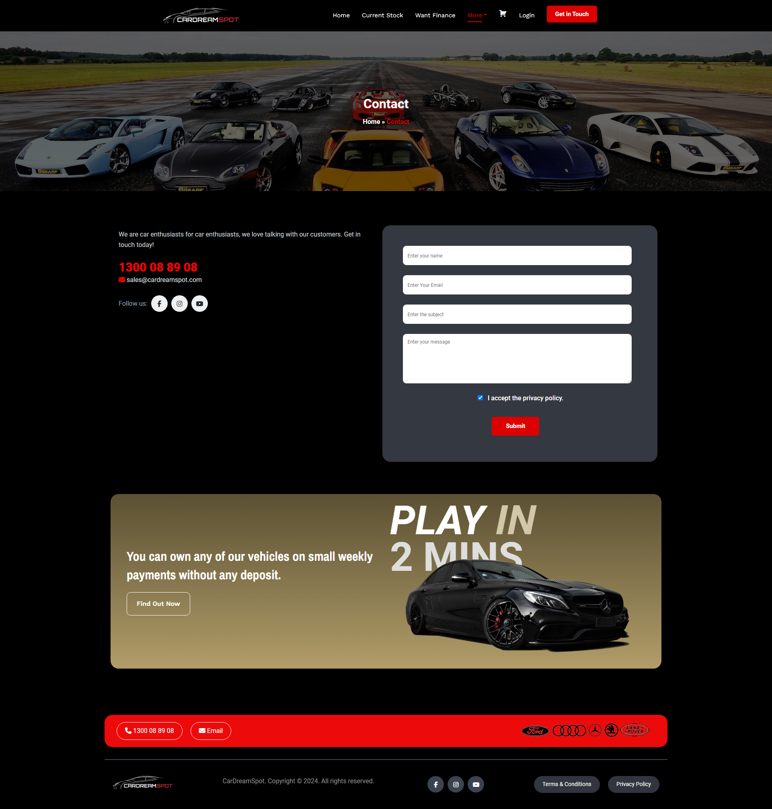
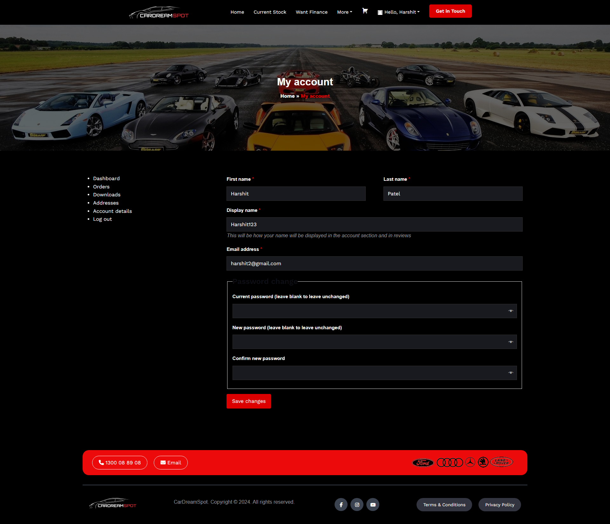

# CarDreamSpot

## Overview
This project is a car rental website developed using WordPress, Elementor, and WooCommerce. It allows users to rent their dream car for a specified period. Users can get a price quotation and detailed information about the car sent to their email. The site includes custom templates and offers a range of functionalities for a seamless rental experience.

## Screenshots

### Home Page

### About Us

### Contact Us

### Current Stock

*Includes both grid and list views of the products (cars).*

### Account Details

### Car Comparison

### Cart

### Login

### Product Page

*Displays car details and similar or related cars.*

### Quotation

### Register

### Sell Your Car

## Functionality

- **User Registration and Login**: Users can register and log in to the site.
- **Car Comparison**: Users can compare up to 3 cars simultaneously.
- **Quotation**: Users can request a quotation for renting a car for a specified period via email.
- **Sell Your Car**: Users can submit their cars for sale.
- **Product Listings**: Users can view cars in both grid and list views.
- **Contact Us**: Users can contact the site for any queries.
- **Finance Information**: Users can get information about financing options.
- **Product Details**: Users can view details of cars on the product page, including similar or related products.

## Technical Details

- **Platform**: WordPress
- **Page Builder**: Elementor
- **E-commerce Plugin**: WooCommerce
- **Custom Templates**: Used for theme customization

Feel free to explore the project and let us know if you have any questions or need further information.
